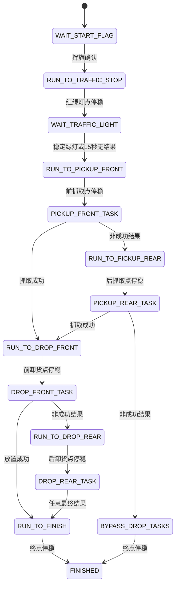
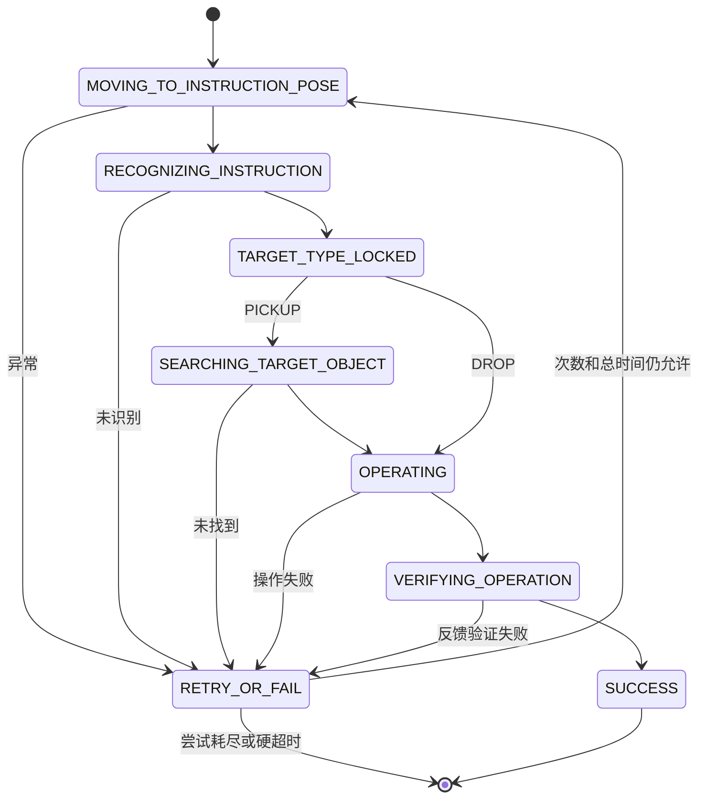

# 室内比赛状态机设计与离线实现

## 已实现事实

主状态链为：

```text
WAIT_START_FLAG
→ RUN_TO_TRAFFIC_STOP
→ WAIT_TRAFFIC_LIGHT
→ RUN_TO_PICKUP_FRONT
→ PICKUP_FRONT_TASK
→ [失败时 RUN_TO_PICKUP_REAR → PICKUP_REAR_TASK]
→ [有货时 RUN_TO_DROP_FRONT → DROP_FRONT_TASK]
→ [前点失败时 RUN_TO_DROP_REAR → DROP_REAR_TASK]
→ [无货时 BYPASS_DROP_TASKS]
→ RUN_TO_FINISH / BYPASS_DROP_TASKS
→ FINISHED
```

主状态机只通过事件和命令接口管理比赛阶段，路线跟踪、精确停靠和全程避障留在控制与规划模块内部：



机械臂是独立的可重试子状态机，一个停车点对应一个 `ArmTask`：



- 挥旗事件只在 `WAIT_START_FLAG` 有效，收到后启动路线。
- 挥旗感知在首次确认后自行锁存 `DONE`，不再运行挥旗检测；相机节点保持共享常驻。
- 距红绿灯停车点 `1.0 m` 时发布非停车标记
  `traffic_light_vision_on`，仅开启算法，不改变规划或避障。
- 红绿灯点满足位置、航向、速度和稳定时间后进入等待。稳定绿灯立即放行；
  `RED/YELLOW` 重置连续无结果计时；`UNKNOWN/OFF` 连续 `15 s` 后降级放行。
- `PICKUP` 先识别图片并锁定目标类型，再识别实物、抓取并确认持物。只有带目标类型
  的确认成功结果会设置 `has_cargo=true`。
- 前点任何非成功结果都前往后点；后点最终失败会放弃本环节并继续。
- 第二装卸点不能被任意跳过：是否停车只取决于对应前点机械臂任务是否成功。
- 装货最终失败会进入 `BYPASS_DROP_TASKS`，经过卸货区但不停车。
- 控制器停稳后进入 `WAIT_RELEASE` 并持续输出零命令，不再按固定时间自动推进。
  总状态机通过 `/mission/checkpoint_release` 指定下一个停车点，可跳过中间检查点。
- 避障仍由规划器全程管理；状态机不启停、不调参。

## ROS 接口

| 方向 | 名称 | 类型 | 含义 |
|---|---|---|---|
| 输入 | `/perception/flag_wave_detected` | `std_msgs/Bool` | 新挥旗事件 |
| 输入 | `/mission/marker_passed` | `std_msgs/String` | 非停车语义标记 |
| 输入 | `/control/status` | `std_msgs/String` JSON | `WAIT_RELEASE`、当前停车点等 |
| 输入 | `/perception/traffic_light_detection` | `std_msgs/String` JSON | 当前原始灯色，用于无结果计时 |
| 输入 | `/perception/traffic_light_state` | `std_msgs/String` | 已稳定确认的绿灯状态 |
| 输出 | `/mission/route_enable` | `std_msgs/Bool` | 挥旗后的路线总使能 |
| 输出 | `/mission/checkpoint_release` | `std_msgs/String` | 显式选择并放行下一停车点 |
| 输出 | `/perception/traffic_light_enable` | `std_msgs/Bool` | 按阶段启停红绿灯推理 |
| 输出 | `/mission/status` | `std_msgs/String` JSON | 当前状态、货物和机械臂任务 |
| 双向 | `/mission/arm_task` | `competition_interfaces/action/ArmTask` | 常驻机械臂任务 |

`ArmTask` 的 `PICKUP` feedback 明确包含图片识别、目标类型锁定、实物搜索、操作和
确认阶段。前点已经锁定的 `target_type` 会作为后点 goal hint 复用。

真实适配器是常驻节点 `piper_arm_task_node`：

- 启动时加载一次视觉模型和 Piper controller，后续每个停车点复用同一实例。
- 节点会检查迁移目录下独立构建的 `piper_ros/install/setup.bash`；若当前进程未加载该
  overlay，会保留比赛工作空间环境并一次性重启到组合环境，然后再导入 `piper_msgs`。
- 共享 RGBD 相机由整车 launch 常驻；适配器参数 `manage_camera=false`，不会重复拉起
  相机。独立启动适配器时可保留默认 `manage_camera=true`，此时仅在目标 RGBD 话题
  没有发布者时启动驱动。
- launch 不再对整个进程注入 `__node:=piper_arm_task`；外层任务节点保持
  `/piper_arm_task`，内嵌控制器保持 `/piper_controller`，避免 Action 图重名。
- PICKUP 会移动到观察位，若 goal 没有目标提示则先识别指令图片；随后定位实物、执行
  抓取。旧脚本中的“抓取后立即放置”调用只在内存中的模块绑定上被屏蔽，原迁移源码
  不变。
- DROP 复用 PICKUP 锁定的目标类型，识别对应卸货图片后才调用独立放置函数。
- PICKUP 仅在抓取流程无异常且最新夹爪开度不小于 `0.002 m` 时成功；DROP 仅在夹爪
  开度不小于 `0.030 m` 时成功。反馈缺失也按失败处理并进入既定恢复分支。
- 室内人工展示指令图片时可设置 `arm_post_instruction_clear_delay_s`，在
  `TARGET_TYPE_LOCKED` 后留出移开图片的时间；比赛默认值为 `0.0 s`，自动流程不暂停。

## 配置与验证证据

- 状态机参数：`config/mission/indoor_competition_mission.yaml`
- 语义路线：`config/routes/indoor_competition_mission_route.yaml`
- 来源一致的轨迹：
  `docs/evidence/day5/indoor_competition_mission_trajectory.yaml`
- 轨迹事实报告：
  `docs/evidence/day5/indoor_competition_mission_trajectory_summary.md`
- 入口：`ros2 launch competition_bringup indoor_competition.launch.py`
- 真实机械臂入口参数：`start_real_arm:=true`（不得与
  `start_arm_simulator:=true` 同时使用）
- 手动静态机械臂和整车实车测试步骤：
  `docs/competition_mission_manual_field_test.md`

2026-08-18 车端无运动验证事实：

- 比赛接口、任务、控制、感知和 bringup 包构建成功；项目针对性测试通过。
- 整套 launch 在 `start_base=false`、`start_chassis_adapter=false`、
  `start_real_arm=false` 下全部启动，`/cmd_vel` 不存在，`/cmd_vel_safe` 无订阅者。
- 模拟 Action 成功路径到达 `FINISHED`，前点抓取成功后直接跳过后抓取点，前点放置
  成功后直接跳过后放置点。
- 红绿灯连续 `15 s` 无结果后按约定继续；前后抓取均失败时进入
  `BYPASS_DROP_TASKS` 并最终到达 `FINISHED`。

2026-08-18 静态真机械臂验证事实（操作员现场确认）：

- 共享相机条件下，前点任务完成指令图片识别、实物识别和抓取，夹爪保持抓取姿态。
- 独立前卸货任务复用抓取结果的 `target_type`，完成卸货图片定位和放置。
- 该结果证明静态装卸闭环可用，不等同于持物行驶或整车路线已经验证。

## 未验证与风险

- 真实 Piper 程序仍是用户未跟踪的迁移源码；适配器运行时依赖车端
  `/home/agilex/competition_ws/Piper_Grasp_Humble_Migration_20260723` 完整存在。本次没有
  修改或提交该目录。
- `0.002/0.030 m` 夹爪确认阈值已通过一次比赛物体静态装卸，但样本量仍有限；它们是
  ROS 参数，只在后续日志显示误判时调整。
- `1.0 m` 红绿灯预触发距离和 `120/90 s` 机械臂总超时是初始配置，需在无底盘运动的
  单模块计时后复核。
- 按已确认范围，第一版没有实现挥旗永久失败和导航不可达恢复。
- ROS 2 车端构建、模拟 Action、任务主/恢复路径和真实 Piper 静态装卸已通过；节点重名
  修复后的 ROS 图、持物行驶及底盘完整路线仍未进行实车验证。
